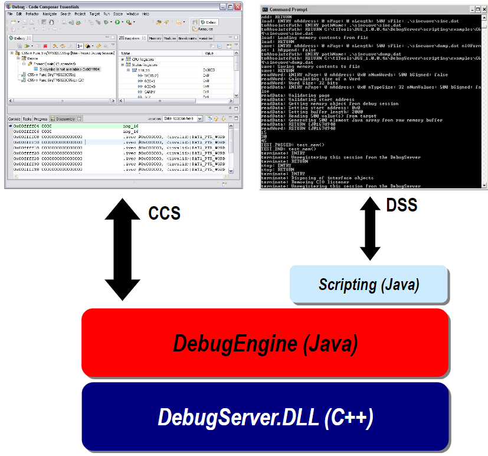
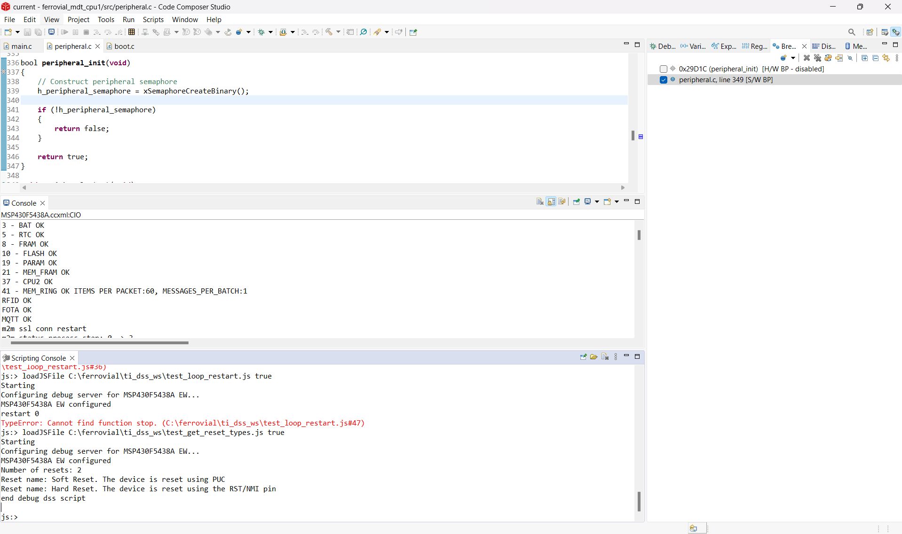

# Debug Server Scripting (DSS) Repository

This repository contains a collection of scripts designed to automate the debugging process using Texas Instruments' Debug Server Scripting interface. These scripts aim to demonstrate how to automate the debugging workflow for Texas Instruments devices, enhancing efficiency and productivity for developers, via DSS Scripts.

## What is Debug Server Scripting (DSS)?

Debug Server Scripting (DSS) is a powerful scripting interface provided by Texas Instruments for automating and extending the capabilities of their debugging tools, such as Code Composer Studio (CCS) and UniFlash. DSS allows developers to write scripts in JavaScript to interact with the debugging environment, control the target device, and perform various debugging tasks programmatically.

DSS can be used along with Code Composer Studio since both are connected to the debug server. 



Besides, DSS is installed by default with Code Composer Studio, allowing to be used together and visualizing the debug session in the CCS GUI while the DSS script is running. This repository is intended to be used directly with Code Composer Studio using the scripting console.




## Key Features and Capabilities

- **Automation:** DSS enables the automation of repetitive debugging tasks, reducing manual intervention and saving valuable time during the development process.
- **Customization:** Developers can create custom debugging workflows tailored to their specific requirements and project needs using DSS scripts.
- **Batch Processing:** DSS scripts support batch processing, allowing users to execute multiple debugging tasks sequentially or in parallel.
- **Integration:** DSS scripts can be integrated seamlessly into existing development workflows, enhancing collaboration and facilitating continuous integration and deployment (CI/CD) processes.
- **Extensibility:** DSS provides an extensible framework, allowing developers to extend the functionality of Texas Instruments' debugging tools beyond their out-of-the-box capabilities.

## Getting Started

To begin using the DSS scripts provided in this repository, follow these steps:

1. **Clone the Repository:**
   Clone this repository to your local machine using Git:
   ```
   git clone https://github.com/your-username/debug-server-scripting.git
   ```

2. **Install Code Composer Studio**
   You can download the installer for your platform from [official Texas Instrument website](https://www.ti.com/tool/CCSTUDIO)

3. **Execute Scripts:**
   Run the DSS scripts using the **scripting console** of CCS, you can read more in the follwing [documentation file](docs/Using%20DSS%20in%20Code%20Composer%20Studio.md).

4. **Customize and Extend:**
   Feel free to customize and extend the provided scripts to suit your specific debugging requirements.

## Directory Structure

The repository is organized as follows:

- **scripts/:** Contains the DSS scripts samples.
- **docs/:** Documentation files, including README and user guides.

## Contributing

Contributions to this repository are welcome! If you have developed useful DSS scripts or enhancements to existing scripts, please consider submitting a pull request. For major changes, please open an issue first to discuss potential modifications or additions.

## Resources

- [Texas Instruments Debug Server Scripting Documentation](https://software-dl.ti.com/ccs/esd/documents/users_guide/sdto_dss_handbook.html#)
- [Texas Instruments DSS fundamental workshop](https://software-dl.ti.com/ccs/esd/training/workshop/ccsv9/dss_fundamentals_workshop.html)
- [DS script API](file:///C:/ti/ccs1220/ccs/ccs_base/scripting/docs/DS_API/index.html)
- [Code Composer Studio (CCS)](https://www.ti.com/tool/CCSTUDIO)

## License

This project is licensed under the [MIT License](LICENSE).