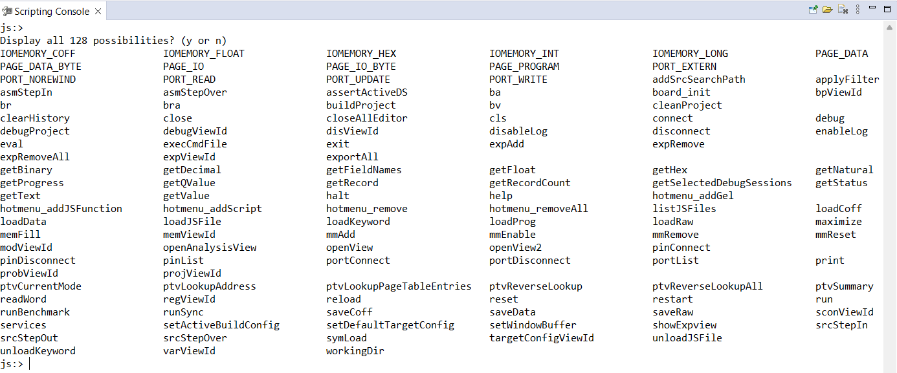

# Using DSS in Code Composer Studio (CSS)
DSS and CSS runs over the same debug server. Thus, it is possible to run scripts based on DSS while visualizing the results in the CSS GUI.

Besides, it is possible to open a **Scripting Console** to run buildin dss functions as well as running a javascript dss script. Go to `View->Scripting Console`, it will open the dss scripting console.



## check all commands

We can check out all the supported command just pressing the `/TAB`. Then, we can check out what each command does with the `help` command, for example:


## Load javascript DSS script
We can simple load a javascript DSS script with the `loadJSFile` command:

```
js:> help loadJSFile 
```

Whose output is:

```
Description: Load a JavaScript file or all the JavaScript files in the directory. Example: loadJSFile c:\myDirectory\myJavaScript.js
Syntax: loadJSFile(file,store)
Arguments: 
  file - the JavaScript file or a directory.
  store - [optional] true, store the file(s) to the preference, the script will auto reload the next time the view is open.

```

We just need to pass the route to the DSS script and select if we want to store the file or not, for example:

```
loadJSFile C:\workspace\scripts\test.js true
```

